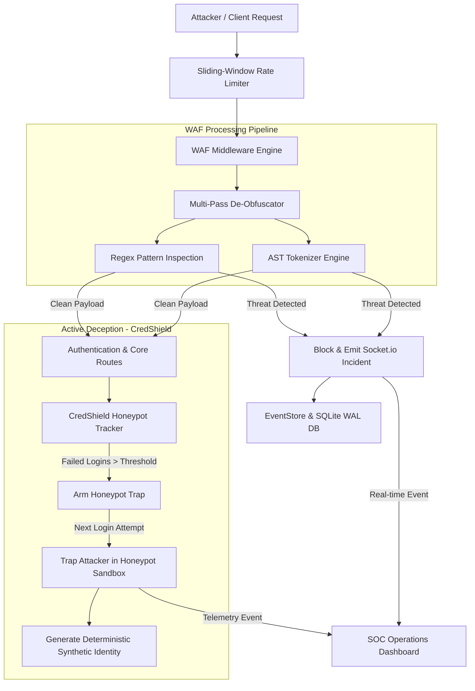

# DeceptiWAF: Active Deception & AST-Driven Web Application Firewall

<p align="center">
  
</p>

<p align="center">
  <b>A next-generation Node.js Security Solution combining multi-pass payload de-obfuscation, AST structural tokenization, and active honeypot deception (CredShield).</b>
</p>

<p align="center">
  <a href="#-system-architecture"></a>
  <a href="#-feature-matrix-deceptiwaf-vs-traditional-wafs"></a>
  <a href="#-quickstart--setup"></a>
</p>

---

## 🛡️ Executive Summary

Traditional Web Application Firewalls (WAFs) rely heavily on static signature matching, making them vulnerable to nested payload obfuscation, encoding tricks, and automated credential stuffing.

**DeceptiWAF** shifts the security paradigm from passive blocking to **active cyber deception**:

- **Multi-Pass De-Obfuscator**: Recursively unwraps URL encoding, hex strings, and HTML entities up to 5 passes to expose obfuscated attack vectors.
- **AST Structural Tokenizer**: Parses SQL and JavaScript expressions into Abstract Syntax Trees (AST) to detect syntactic anomalies beyond regex signatures.
- **CredShield Active Honeypot**: Rather than locking out brute-force attackers, CredShield silently traps them in an isolated **Honeypot Sandbox**.
- **Synthetic Identity Engine**: Trapped attackers receive realistic, dynamically generated student profiles bound to their target user ID, keeping them engaged while logging full threat telemetry.
- **Real-Time SOC Console**: Broadcasts threat events, IP geolocation, browser fingerprints, and honeypot activations to a live glassmorphism Security Operations Center (SOC) dashboard via Socket.io.

---

## 📊 Feature Matrix: DeceptiWAF vs. Traditional WAFs

| Security Capability | Traditional Regex WAF | Static Rate Limiter | DeceptiWAF |
|---------------------|-----------------------|---------------------|------------|
| **Obfuscated Payload Decoding** | Single-pass URL decode | ❌ None | **5-Pass Recursive Multi-Format** |
| **SQLi / XSS Inspection** | Regex string matching | ❌ None | **Regex + AST Structural Tokenization** |
| **Brute-Force Mitigation** | IP Lockout (403/429) | Drop Connection | **CredShield Active Honeypot Sandbox** |
| **Attacker Feedback** | Explicit Block Error | Connection Reset | **Zero Indicator (Fake Profile Deception)** |
| **Telemetry & Analytics** | Static Server Logs | Basic Counters | **Real-Time Socket.io Glassmorphism SOC** |

---

## 📐 System Architecture



---

## 🔌 Complete API Endpoint Reference

| Method | Endpoint | Access Level | Required Parameters | System Action & Response Payload |
|--------|----------|--------------|---------------------|----------------------------------|
| `POST` | `/login` | Public | `studentId`, `password` | Authenticates student against `data/users.json` or intercepts trapped IP returning a synthetic identity. |
| `POST` | `/logout` | Authenticated | Cookie: `deceptiwaf_session` | Destroys in-memory session and removes SQLite WAL record. Redirects to `/`. |
| `GET` | `/api/me` | Authenticated | Cookie or Query `?token=` | Returns authentic student object or synthetic honeypot profile JSON. |
| `GET` | `/api/events/recent` | Admin | `?limit=` (default 50) | Retrieves recent security incidents, WAF blocks, and honeypot activations. |
| `GET` | `/api/attackers/top` | Admin | `?limit=` (default 20) | Returns catalog of top threat source IPs ordered by attack volume. |
| `GET` | `/api/stats` | Admin | Query `?token=` | Aggregated metrics: total threats, WAF blocks, active honeypots, and cache stats. |
| `GET` | `/api/honeypot/status` | Admin | Query `?token=` | Returns snapshot of all tracked IPs, failed attempt counters, and trap states. |
| `POST` | `/api/honeypot/reset` | Admin | Body/Query `ip=` (optional) | Disarms active honeypot traps for a specific IP or clears all disarmed states. |
| `POST` | `/api/events/clear` | Admin | Query `?token=` | Wipes incident history from memory buffer and SQLite WAL database. |
| `GET` | `/health` | Public | None | Server pulse check. Returns `{ "ok": true, "ts": 1784847214000 }`. |

### Socket.io Real-Time Event Matrix

| Event Name | Type | Data Payload Structure | Description |
|------------|------|------------------------|-------------|
| `waf_blocked` | Broadcast | `{ ip, url, rule, payload, geo, fingerprint }` | Emitted instantly when WAF blocks SQLi, XSS, or Path Traversal |
| `honeypot_event` | Broadcast | `{ ip, username, attempt, fakeIdentity, geo }` | Emitted when CredShield arms or traps an attacker in the sandbox |
| `soc_reset` | Broadcast | `{ action: "reset", target: "all" }` | Emitted when administrator disarms traps or clears SOC counters |

---

## ⚡ Attack Scenario & Telemetry Walkthrough

### Scenario 1: Legitimate Student Authentication
A valid student logs in with authentic credentials:
```bash
curl -i -X POST http://localhost:3000/login \
  -d "studentId=21cs104&password=21cs104@2024"
```
**System Behavior**:
- Password verified against SHA-256 hash in `data/users.json`.
- Session issued and stored in SQLite WAL (`lib/db.js`).
- Redirects to `/dashboard?token=<session_token>`.

---

### Scenario 2: Multi-Pass Obfuscated WAF Interception
An attacker attempts a nested URL-encoded SQL injection payload (`%2527%20OR%201=1%20--`):
```bash
curl -i "http://localhost:3000/?search=%2527%20OR%201=1%20--"
```
**System Behavior**:
1. `lib/waf.js` unwraps Pass 1 (`%27 OR 1=1 --`) and Pass 2 (`' OR 1=1 --`).
2. Regex and AST engines identify tautological SQL injection.
3. Request terminated immediately:
```http
HTTP/1.1 403 Forbidden
Content-Type: text/html

<!DOCTYPE html>
<html>... 403 Security Violation: SQL Injection Detected ...</html>
```
4. Socket.io emits `waf_blocked` event to the SOC Dashboard.

---

### Scenario 3: CredShield Active Deception & Sandbox Trapping

#### 1. Brute-Force Phase (Triggering Threshold)
An automated script submits 3 consecutive invalid login attempts:
```bash
for i in {1..3}; do
  curl -s -X POST http://localhost:3000/login \
    -d "studentId=21cs104&password=invalid_pass_$i" > /dev/null
done
```
**Server Log**: `[HONEYPOT ARMED] ip=127.0.0.1 next login will be trapped`

#### 2. Sandbox Trapping Phase
The attacker submits a 4th login attempt (even with bogus credentials):
```bash
curl -i -X POST http://localhost:3000/login \
  -d "studentId=21cs104&password=anything"
```
**System Response**:
```http
HTTP/1.1 302 Found
Set-Cookie: deceptiwaf_session=a4f9b2...; Path=/; HttpOnly
Location: /dashboard?token=a4f9b2...
```
**Deception Effect**:
- The attacker receives HTTP 302 Redirect to `/dashboard` and believes the login succeeded.
- `lib/fakeProfile.js` generates a realistic synthetic student profile bound to `21cs104`.
- The attacker is trapped in an isolated sandbox (`public/honeypot.html`).
- The SOC dashboard receives a live `honeypot_event` broadcast containing the attacker's IP geolocation, browser fingerprint, and targeted user ID.

---

## 🚀 Quickstart & Deployment

```bash
# 1. Clone Repository & Install Dependencies
git clone https://github.com/aryankaran/DeceptiWAF.git
cd DeceptiWAF
npm install

# 2. Seed Student Credentials Database
node scripts/generate-users.js

# 3. Start Server
npm start
```

Access Points:
- **Public Login**: `http://localhost:3000/`
- **SOC Dashboard**: `http://localhost:3000/soc`
- **Attack Simulator**: `http://localhost:3000/test`
- **Slide Viewer**: `http://localhost:3000/slides`

---

## 🧪 Automated Security Test Suite

Run the built-in WAF attack simulator script:
```bash
chmod +x scripts/test-waf.sh
./scripts/test-waf.sh
```

---

## 📄 License & Attribution

Created by **Aryan Karan**. Developed for cybersecurity research, academic defenses, and security engineering demonstrations.
