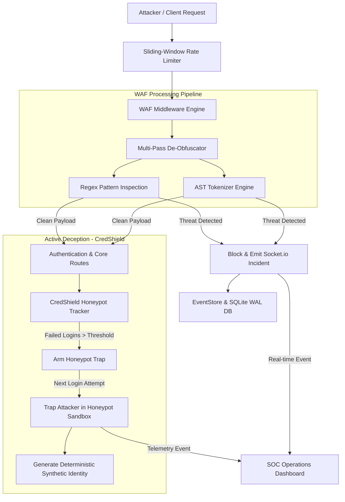

# DeceptiWAF: Active Deception & AST-Driven Web Application Firewall

<p align="center">
  
</p>

<p align="center">
  <b>A next-generation Node.js Security Solution combining multi-pass payload de-obfuscation, AST structural tokenization, and active honeypot deception (CredShield).</b>
</p>

---

## 🛡️ Executive Summary

Traditional Web Application Firewalls (WAFs) rely heavily on static signature matching, making them vulnerable to nested payload obfuscation, encoding tricks, and automated credential stuffing.

**DeceptiWAF** shifts the paradigm from passive blocking to **active cyber deception**. When an attacker repeatedly attempts brute-force logins or payload injection:
1. **Multi-Pass De-Obfuscation**: Recursively unwraps URL encoding, hex encoding, and HTML entities to reveal hidden attack vectors.
2. **AST Structural Tokenization**: Parses incoming SQL and JavaScript expressions into Abstract Syntax Trees (AST) to detect syntactic anomalies beyond regex signatures.
3. **CredShield Active Deception**: Rather than outright blocking brute-force attackers, CredShield silently shifts the attacker into an isolated **Honeypot Sandbox**.
4. **Deterministic Synthetic Profiles**: Trapped attackers receive realistic, dynamically generated student profiles bound to their target user ID, keeping them engaged while logging full threat telemetry.
5. **Real-Time SOC Console**: Broadcasts threat events, IP geolocation, browser fingerprints, and honeypot activations to a live glassmorphism Security Operations Center (SOC) dashboard.

---

## 📐 System Architecture



---

## 🛠️ Core Security Modules Breakdown

### 1. Multi-Pass Payload De-Obfuscation (`lib/waf.js`)
Attackers often attempt to evade signature detection using nested encoding (e.g., `%2527%20OR%201=1`).
- **Recursive Decoding**: Processes requests up to 5 recursive passes of URL decoding, hexadecimal string parsing, and HTML entity unescaping.
- **Pattern Matching**: Inspects sanitized strings for SQLi (`UNION SELECT`, `--`, `;`), XSS (`<script>`, `onerror=`, `javascript:`), Path Traversal (`../`, `..\\`), and Scanner User-Agents (`sqlmap`, `nikto`, `nmap`).

### 2. AST Structural Tokenizer (`lib/astWaf.js`)
- Tokenizes incoming query parameters and POST bodies into abstract syntax trees.
- Identifies structural anomalies such as tautological SQL clauses (`OR 1=1`, `'a'='a'`) and execution sinks (`eval()`, `Function()`).

### 3. CredShield Active Deception Trap (`lib/credshield.js`)
- Tracks authentication failures per IP address against `HONEYPOT_THRESHOLD`.
- **Silent Redirection**: Once triggered, instead of returning HTTP 403 or locking out the IP, CredShield arms the trap. On the next login attempt, it returns HTTP 200 with a valid session cookie pointing to a sandbox environment.

### 4. Dynamic Synthetic Identity Engine (`lib/fakeProfile.js`)
- Generates rich, realistic student profile data (full name, roll number, academic branch, GPA, fee status, hostel allocation, and activity logs).
- **Deterministic Identity**: Ensures that repeated logins under the same username return identical fake profiles, maintaining illusion integrity for the attacker.

### 5. Real-Time SOC Dashboard (`public/soc.html`)
- Built using modern glassmorphism styling, soft pastel indicators, and responsive CSS.
- Integrates Socket.io for sub-second telemetry updates:
  - Active Threat Counter & Honeypot Trap Activation metrics.
  - Interactive Geolocation Threat Map (`lib/geo.js`).
  - Attacker Browser Fingerprinting (`User-Agent`, `Sec-Ch-Ua`, `Accept-Language`, `Referer`).

### 6. Persistence Layer (`lib/db.js`)
- Operates on **SQLite WAL (Write-Ahead Logging)** mode via `better-sqlite3`.
- Safely persists active sessions, incident logs, and threat events across application restarts.

---

## 🚀 Quickstart & Installation

### Prerequisites
- Node.js (v18+) or Bun runtime
- npm / yarn / bun

### 1. Clone & Install Dependencies
```bash
git clone https://github.com/aryankaran/DeceptiWAF.git
cd DeceptiWAF
npm install
```

### 2. Generate Student Account Database
Generate SHA-256 hashed credentials for the user dataset:
```bash
node scripts/generate-users.js
```

### 3. Run Development Server
```bash
npm start
```
The application server will start on `http://localhost:3000`.

---

## 🌐 Application Route Matrix

| Route | Access Level | Description |
|-------|--------------|-------------|
| `/` | Public | Main login portal (Stripe SaaS UI layout) |
| `/dashboard` | Student / Trapped | User dashboard (Displays real or synthetic profile) |
| `/soc` | Admin | Real-time SOC Security Console & Attack Telemetry |
| `/slides` | Public | Interactive presentation deck web viewer |
| `/api/events` | Admin | Fetches recent threat log buffer from SQLite DB |
| `/api/stats` | Admin | Aggregated attack metrics & honeypot statistics |
| `/api/reset` | Admin | Resets SOC counter metrics & active honeypot traps |

---

## 🧪 Security Testing & Verification

An automated WAF test harness script is included in `scripts/test-waf.sh`:
```bash
chmod +x scripts/test-waf.sh
./scripts/test-waf.sh
```
This script executes a battery of test payloads (obfuscated SQLi, XSS vectors, and brute-force sequences) against the local server to verify de-obfuscation and honeypot activation.

---

## 📄 License & Attribution

DeceptiWAF is developed for cybersecurity research, academic defenses, and security demonstration purposes. Created by **Aryan Karan**.
